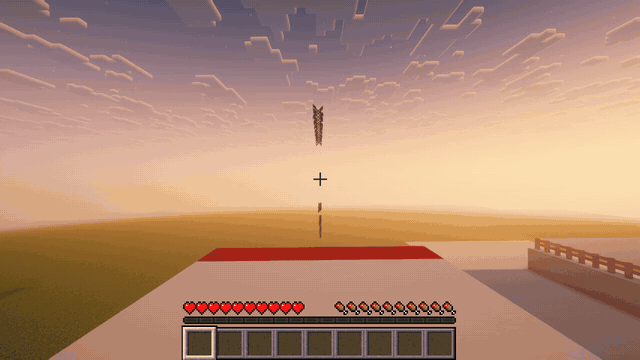
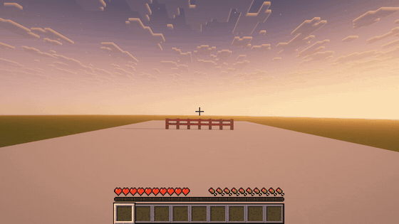
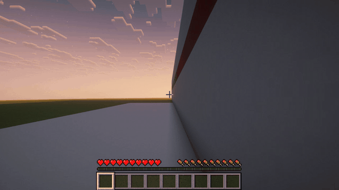
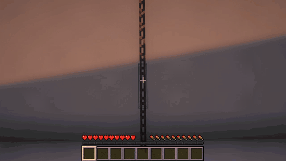
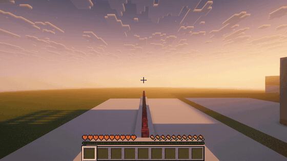
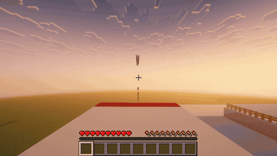
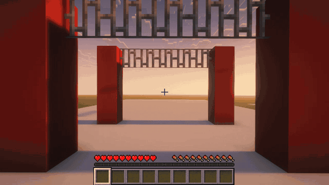
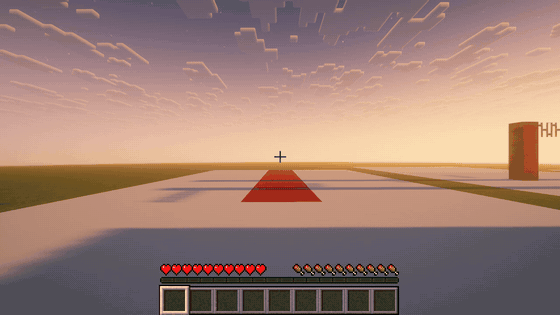
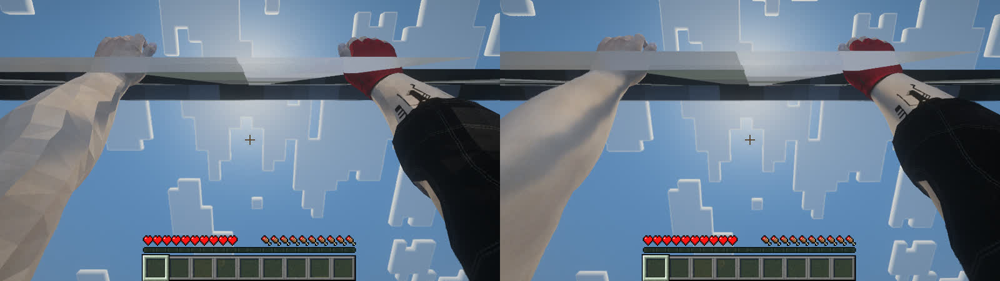
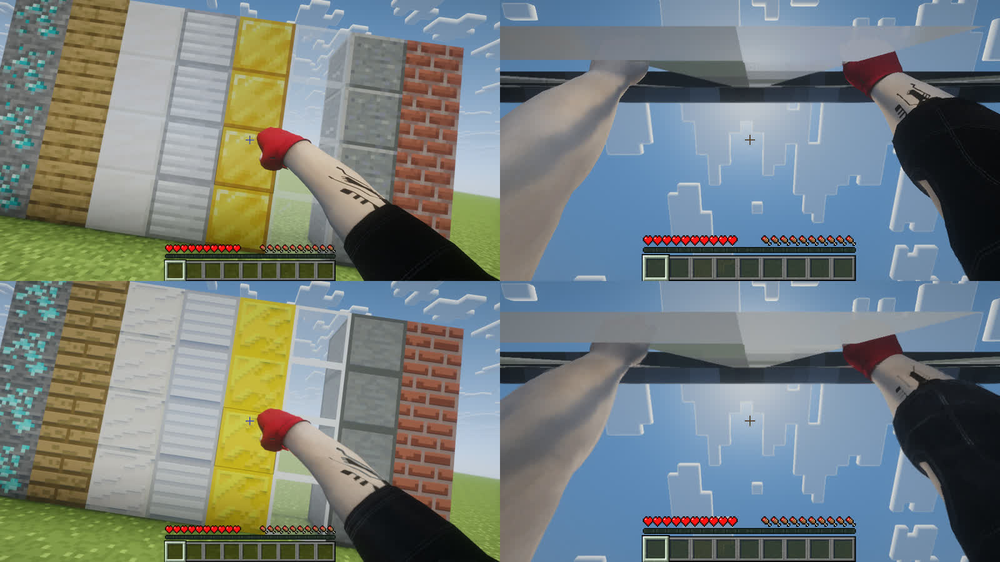

# Mirror's Edge in Minecraft

**Faith Connors' movement, first-person body, animations and sounds from Mirror's Edge (2008),
driving the player in Minecraft Java 26.3.** Sprint, vault railings, wallrun, climb drainpipes,
walk balance beams, ride ziplines and swing on bars through any Minecraft world, with Faith's
own arms and legs in view, under shaders.



> **Built on [tnrjns/faith-runner-minecraft](https://github.com/tnrjns/faith-runner-minecraft)**
> and its movement engine [tnrjns/faith-runner](https://github.com/tnrjns/faith-runner). The
> Rust engine (`crates/`), the original Fabric mod and the whole Mirror's Edge reimplementation
> are their work; this repository keeps their history and adds to it (see
> [What's new here](#whats-new-in-this-repository)). The original repository has no license.
>
> **AI disclosure:** the additions in this repository were written with Claude (Anthropic's
> Claude Code), directed and tested by the repository owner.
>
> **No game files here.** Faith's meshes, textures, animations and sounds are read at startup
> from **your own copy of Mirror's Edge (PC)**. Nothing from the game is in this repository.

---

## Contents

- [What it does](#what-it-does)
- [What's new in this repository](#whats-new-in-this-repository)
- [Gallery](#gallery)
- [Building Mirror's Edge courses out of Minecraft blocks](#building-mirrors-edge-courses-out-of-minecraft-blocks)
- [Requirements](#requirements)
- [Installing](#installing)
- [Shaders (recommended)](#shaders-recommended)
- [Playing](#playing)
- [Building from source](#building-from-source)
- [Tests](#tests)
- [How it works](#how-it-works)
- [Known limitations](#known-limitations)
- [Credits](#credits)

---

## What it does

- **Mirror's Edge's movement, move for move.** The same Rust controller as `faith-runner`,
  rebuilt from the game's own code: the sprint build-up curve, six kinds of vault, wallruns and
  wall-to-wall jumps, wallclimbs and ledge grabs, shimmying, slides, coil jumps, skill rolls and
  hard landings, 180° turns, springboards, swing poles, ziplines, balance beams, door barges and
  kicks, and melee (punches, jump kicks, slide kicks, wallrun kicks). It replaces Minecraft's
  own movement while she's on.
- **Faith's body.** Her first-person arms (in the hand pass, so they never clip into walls) and
  her legs (in the world, so blocks hide them), her camera animations, and her sounds, all from
  your copy of the game. Each part of her body is lit by the block it's in, and whatever is in
  your main hand sits in her right hand.
- **Minecraft blocks become Mirror's Edge fixtures.** Ladders, doors, stairs, slabs, hay,
  fences, walls, iron bars and chains each become something she uses (the full list is
  [below](#building-mirrors-edge-courses-out-of-minecraft-blocks)).
- **Plays as Minecraft.** Switch her on and off with **F8**. Swimming, lava, boats, horses,
  minecarts, elytra and creative flight hand the player back to Minecraft automatically, and
  she takes over again once you're on your feet, so a whole survival game (Ender Dragon
  included) is playable.
- **Shaders.** Works with Iris and Sodium: smooth shading on her body, her own normal and
  specular maps for LabPBR shader packs, and her body (not Steve's) casting the shadow.

## What's new in this repository

On top of the original mod:

| Feature | What it does |
| --- | --- |
| **Water, lava, vehicles and elytra hand-off** | Faith has no move for these, so Minecraft takes over while you swim, wade through lava, ride anything, glide or fly in creative, and gives the player back to her once you're on the ground or a ladder. Your speed carries into the dive or the glide. A jump in the air opens the elytra only while she's falling free, never off a wallrun or a ledge. |
| **Drainpipes** | Upright chains, end rods or lightning rods (3+ blocks) against a wall: she climbs them and out onto the roof. |
| **Ziplines** | A line of horizontal chains stepping down a block at a time: jump up to it and ride it down. |
| **Balance beams** | A straight run of fences or walls along the top of a one-block-wide wall: her balance walk, with the game's lean model. |
| **Railings** | Fences and walls are as high to her as they look (one block, not Minecraft's anti-jump block and a half), so she vaults them. |
| **Smooth shading under shaders** | Iris was flattening her normals to one per triangle, so her skin looked faceted, like stone. Fixed. |
| **Her normal and specular maps** | Her skin, glove and clothes keep their detail (muscle, folds, creases) under LabPBR shader packs, read from your copy of the game and converted at startup. |
| **Crash fix** | Changing resource or shader packs mid-game no longer crashes once her maps are loaded. |
| **Melee hits mobs** | Her punches, jump kicks, slide kicks and wallrun kicks hurt and knock back Minecraft mobs, with Mirror's Edge's own target choice, hit tests and damage (scaled so a mob takes as many blows as a cop would). Kills count as yours: loot, XP, advancements. |
| **Footstep and hand surfaces** | Her steps sound like what she's on: concrete, wood, metal, grating, airduct (copper grates), ladders, pipes (chains, rods), chain-link (bars), glass, cardboard (wool, hay) and water, from her feet on the floor or the wall she's running along and her hands on what she holds. |
| **Controls screen** | A "Faith Runner controls" button on the pause menu: every key as it's bound now, tips for her harder moves, and the blocks she uses, with a shortcut to Minecraft's key bindings. |
| **Distant Horizons** | `-PwithDH` adds Distant Horizons to the dev and test runs (alongside `-PwithIris`). |
| **More tests** | Client game tests for each of the above, a close-up suite for judging her body under shaders, and options to pick suites, shader settings and a resource pack. `./gradlew deploy` works again. |

## Gallery

All captured from the mod's own client tests (Fabric client game tests drive the real game),
under Iris with Complementary Reimagined (LabPBR mode) and the Simplista texture pack.

**Vault and wallrun**

 

**Drainpipe and balance beam**

 

**Zipline and swing bars**

 

**Slide**



The whole run in one video (1280x720, about a minute): [docs/media/showcase.mp4](docs/media/showcase.mp4).

**Her body under shaders.** Before and after the shading fix (left: faceted; right: smooth), and
with her own normal and specular maps (bottom row):




## Building Mirror's Edge courses out of Minecraft blocks

| Build this | She does this |
| --- | --- |
| **Ladder** or **vines** up a wall | Climbs it; steps off the top onto the roof if there's room. |
| **Upright chains / end rods / lightning rods**, 3+ high, against a wall | Climbs it as a drainpipe, and over the top onto the roof. |
| **Horizontal chains** in a line, each level with the last or one lower, 6+ long, sloping 4–30° (one step down every 2 to 14 chains), with room to hang under it and a floor 1–3.5 m below its top end | A zipline: jump up to grab it and ride it down. |
| **Fences or walls** in a straight line, 3+ long, along the top of a one-block-wide wall (nothing beside them at their level or the block below) | A balance beam: she walks it with her balance model. Look or lean off it and she loses her balance. |
| **Fence or wall** on the ground | A railing to vault. |
| **Iron bars, copper bars or fences** with 2 clear blocks under them | A swing pole: jump to it, pump, fly off. |
| **Wooden door** (closed) | Barge through it at a run, or kick it open standing (melee); the Minecraft door opens. |
| **Stairs** (straight, bottom half) | A ramp she runs up. |
| **Slabs / half blocks** | Step-ups. |
| **Hay bale** or **slime block** | A soft landing for a big drop. |
| Anything solid | Walls to wallrun (1.9 m+ tall) and wallclimb, ledges to grab, obstacles to vault, edges to springboard off. |

Water deeper than a block, lava, boats, horses, minecarts, an open elytra and creative or
spectator flight are all Minecraft's while they last; she takes over again on the ground.

## Requirements

- **Mirror's Edge (2008) for PC**: Steam (app 17410) or the EA app. *Not* Mirror's Edge
  Catalyst: that's a different engine with different files. Without the game the movement
  still works, but there's no body, camera animation or sound.
- Minecraft Java **26.3**, Fabric Loader **0.19.5**, Fabric API **0.161.0+26.3**.
- Java **25** (the launcher's own runtime for 26.3 is fine). Minecraft must be started with
  `--enable-native-access=ALL-UNNAMED` in its JVM arguments.
- Windows.
- To build: Rust (stable) and a JDK 25.

## Installing

1. Install Mirror's Edge (PC). The usual Steam, EA and Origin folders are found by themselves.
2. Install Fabric Loader 0.19.5 for 26.3 (the [Fabric installer](https://fabricmc.net/use/),
   client, no profile needed).
3. In the launcher, make a profile on `fabric-loader-0.19.5-26.3`. Give it its **own game
   directory** (e.g. `%APPDATA%\.minecraft\faithrunner-26.3`), and add
   `--enable-native-access=ALL-UNNAMED` to its JVM arguments.
4. Put [Fabric API](https://modrinth.com/mod/fabric-api) and `faithrunner-1.0.0.jar` in that
   directory's `mods/`, and `faith_ffi.dll` in the directory itself. (Build them as below, or
   run `./gradlew deploy`, which builds both and puts them there.)
5. Start the game once. `config/faithrunner.properties` is written in the game directory:
   - `faith_ffi`: the path to the DLL, if you keep it somewhere else;
   - `mirrors_edge`: your Mirror's Edge folder, if it isn't in a usual place.

## Shaders (recommended)

The look in the gallery:

1. [Sodium](https://modrinth.com/mod/sodium) 0.9.2 and [Iris](https://modrinth.com/mod/iris)
   1.11.7 for 26.3 in `mods/`.
2. [Complementary Reimagined](https://modrinth.com/shader/complementary-reimagined) r5.9.3 in
   `shaderpacks/`, selected in Video Settings → Shader Packs.
3. In its Shader Settings, set **RP Support** to **labPBR**, so Faith's normal and specular
   maps are used. (Optional: Camera → Motion Blur on, for the blur when turning.)
4. For the blocks, a LabPBR resource pack, e.g.
   [Simplista](https://modrinth.com/resourcepack/simplista) (64x, clean, made for 26.3).
   Without one, LabPBR mode leaves blocks plainer than Complementary's default mode.

## Playing

| Key | Action |
| --- | --- |
| **F8** | Faith on / off |
| WASD, mouse | Move, look |
| **Space** | Jump, vault, wallrun, wallclimb, grab, pull up, kick off a wall |
| **Shift** | Crouch, slide (at a run), coil (in the air), roll (just before landing), let go |
| **Z** | 180° turn (on the ground, in the air, on a wall, ledge or pole; on a wallrun, look out from the wall to jump across to another) |
| **Left click** | Melee: punches, jump kick, slide kick, wallrun kick; barges and kicks doors. While she's on it replaces Minecraft's attack and mining (switch her off with F8 to break blocks) |

F8, Z and the melee click can be rebound in Controls. WASD, Space and Shift are Minecraft's own bindings.
In game, **Faith Runner controls** on the pause menu lists them all, as they're bound now.

Tips:
- **Sprint builds up** like the game's: 4 m/s at 0.4 s up to 7.2 m/s at 7 s. Whipping the view
  round sheds speed.
- **Wallrun**: run at a wall at an angle, jump, hold forward. To wallrun a wall you're already
  beside, hold a little A or D toward it as you jump.
- **Roll** out of drops over 2 m by pressing Shift in the last 0.2 s before landing; drops of
  5.3 m+ otherwise stop you dead.
- **Dodge**: A or D + Space.

She works in singleplayer: the integrated server accepts her movement (no "moved wrongly"), and
Minecraft's fall damage is off while she's in control (her own hard landings stand in for it).

## Building from source

```sh
# the engine, as faith_ffi.dll (target/release/)
cargo build --release -p faith_ffi

# the mod (minecraft/build/libs/faithrunner-1.0.0.jar)
cd minecraft
./gradlew build

# or both, copied into %APPDATA%\.minecraft\faithrunner-26.3 (mods/ and the game folder)
./gradlew deploy
```

## Tests

Fabric client game tests start the real game, build a world, switch Faith on and drive her
through each kind of block, failing on the first thing that doesn't work. Screenshots go to
`minecraft/build/run/clientGameTest/screenshots`.

| Suite | Checks |
| --- | --- |
| `Blocks` | Ladders, doors, stairs, slabs, hay, swing bars, a held item, punches, her shadow |
| `HandOff` | A dive into a pool and a swim out, a one-deep ditch (no hand-off), lava, a boat, an elytra glide off a tower |
| `CloseUp` | Her body large in frame at 1600x900 (punch at a wall, door kick, vault, a row of materials), for judging shading |
| `Fixtures` | Drainpipe, zipline, fence beam, wall beam, railing vault |
| `Showcase` | Footage only (runs only when named): the course in the gallery, logging when each move starts so a recording can be cut |

```sh
cd minecraft
./gradlew runClientGameTest --no-configuration-cache                    # all suites
./gradlew runClientGameTest -Ptests=Fixtures,HandOff --no-configuration-cache   # just these

# the gallery's footage: the window opened at 1280x720 (recordable), shaders, LabPBR, Simplista
./gradlew runClientGameTest -Ptests=Showcase -PwindowSize=1280x720 -PwithIris -PwithShader   -PshaderOptions="RP_MODE=3,MOTION_BLUR_EFFECT=1" -PresourcePack=<Simplista.zip> --no-configuration-cache

# under Iris + Sodium with a shader pack, its options, and a resource pack
./gradlew runClientGameTest -PwithIris -PwithShader -PshaderZip=<pack.zip> \
  -PshaderOptions="RP_MODE=3" -PresourcePack=<pack.zip> --no-configuration-cache
```

The engine's own tests: `cargo test`. The animation tests need `ME_INSTALL` set to your Mirror's
Edge folder; without it they pass without checking anything.

## How it works

- **Engine** (`crates/`, Rust): `faith_move` is Mirror's Edge's movement, rebuilt from the
  game's code and native routines; `faith_anim` plays its animations on her skeleton;
  `me_assets` reads the game's Unreal Engine 3 packages (meshes, animations, textures, sound)
  from your install; `faith_ffi` wraps it all as `faith_ffi.dll`.
- **Mod** (`minecraft/`, Java, Fabric): calls the DLL through Java's foreign function API. Each
  frame it steps her with your input and puts the player where she is. Every few ticks it reads
  the blocks around you as her collision, marking ladders, doors, pipes, beams, poles, ziplines
  and soft landings as Mirror's Edge fixtures. It draws her body in Minecraft's hand pass and
  world pass, and with Iris hands her normal and specular maps to the shader pack as LabPBR
  textures. Mixins switch off Minecraft's own movement while she drives, and hand the player
  back to it for water, lava, vehicles and elytra.

## Known limitations

- **Singleplayer only.** The server-side relaxations apply to the singleplayer owner.
- **Reaction Time** (slow motion) isn't there.
- **Her melee only hurts mobs in singleplayer** (the damage is applied on the integrated server).
- **No fall damage** while she's in control. Her hard landings stand in for it.
- **Chains sit in the middle of their block**, so on a drainpipe she hangs half a block further
  from the wall than in the game, and a zipline looks like a staircase of chains.
- Coming out of water, a vehicle or a glide, she starts from a standstill.
- LabPBR shader mode needs a LabPBR resource pack for blocks to keep their materials.

## Credits

- **[tnrjns](https://github.com/tnrjns)**: [faith-runner](https://github.com/tnrjns/faith-runner)
  (the Mirror's Edge movement and animation engine) and
  [faith-runner-minecraft](https://github.com/tnrjns/faith-runner-minecraft) (the Fabric mod this
  is built on).
- **Mirror's Edge** © Electronic Arts / DICE. This project needs your own copy, and contains
  none of its files.
- **Minecraft** © Mojang Studios. Not affiliated with or endorsed by Mojang or Microsoft.
- [Fabric](https://fabricmc.net/), [Iris and Sodium](https://www.irisshaders.dev/),
  [Complementary Reimagined](https://www.complementary.dev/) by EminGT, and
  [Simplista](https://modrinth.com/resourcepack/simplista) by ShivamZter appear in the
  screenshots. None of them are included here.
- Additions in this repository written with Claude (Anthropic).
